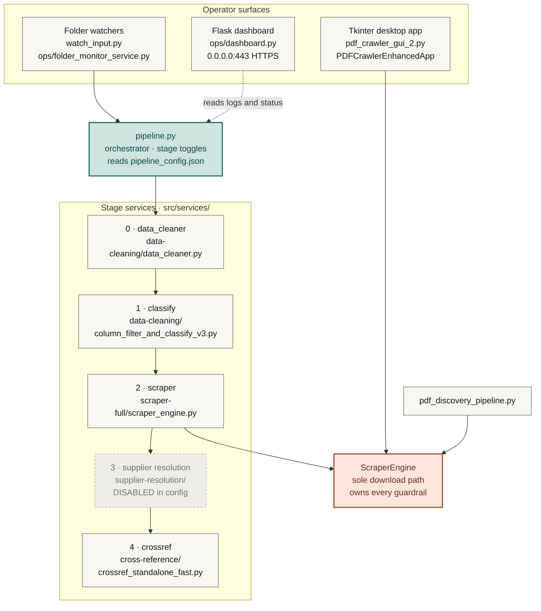
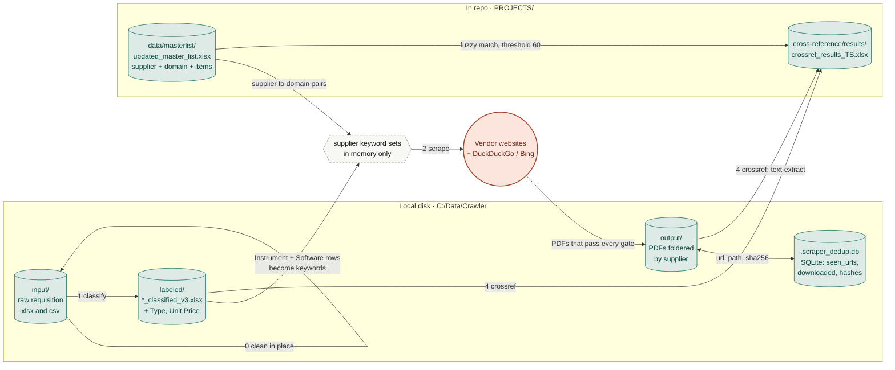
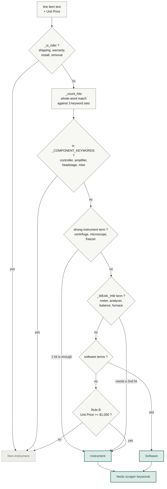
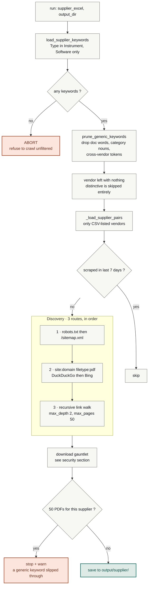
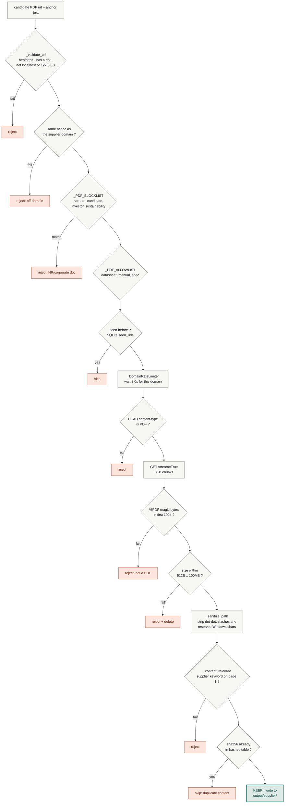

# Crawler — Architecture, Data Flow & Security

> Read from the working tree on branch `cleanup/ponytail-audit`, 2026-07-24.
> Styled version: https://claude.ai/code/artifact/a5c38b6e-a7a0-4c82-b2a8-5cc92751d9f9
> Diagrams below are mermaid — they render in VS Code preview and on GitHub.

Crawler turns raw purchase requisitions into a short, defensible list of vendor
documents. Five stages, one crawl engine, and about a dozen gates whose only job
is to throw things away.

Validated end-to-end run (2026-07-14):

| rows read | classified Instrument/Software | keyword tokens | pages crawled | PDFs kept |
|---:|---:|---:|---:|---:|
| 17,201 | 4,271 | 1,682 | 903 | **31** |

Each column is the input to the next — roughly one PDF per 550 requisition rows.

---

## 1. Components

One orchestrator, five stage services, two operator surfaces, and a single crawl
engine that every download path must route through. The engine is deliberately
the only door: the pipeline, the Tkinter GUI, and `pdf_discovery_pipeline.py`
all call the same object.

| Part | File | Role |
|---|---|---|
| Orchestrator | `src/services/pipeline.py` | Runs stages in order, per-stage CLI skip/only flags, `stop_on_failure` |
| Config | `src/services/pipeline_config.json` | Paths, stage toggles, scraper caps, crossref threshold |
| Crawl engine | `scraper-full/scraper_engine.py` | Discovery, download, validation, dedup, rate limiting, state DB |
| Desktop GUI | `scraper-full/pdf_crawler_gui_2.py` | Manual crawl driver; log pane via `_TkLogHandler` |
| Web dashboard | `ops/dashboard.py` | Flask status page, `/` and `/api/status` |
| Watchers | `watch_input.py`, `ops/folder_monitor_service.py` | Trigger a run when new input lands |
| Tests | `tests/`, per-service `tests/unit/` | Classifier, keyword pruning, PDF relevance, scraper security |
| Keyword audit | `tools/audit_keywords.py` | One-off list audit tooling |

---

## 1b. Technology stack & protocols

### Runtime

| Layer | Technology | Version / Notes |
|---|---|---|
| Language | Python 3.x | CPython on Windows 11 |
| HTTP client | `requests` + `urllib3` | All outbound web traffic; session-based with retry adapter |
| HTML parsing | `beautifulsoup4` (html.parser) | Extracts links and search results from HTML pages |
| Spreadsheet I/O | `pandas` + `openpyxl` + `xlrd` | All Excel/CSV read/write throughout the pipeline |
| PDF text extraction | `PyPDF2` + `pdfplumber` | crossref stage reads first-page text for relevance + matching |
| Desktop GUI | `tkinter` (stdlib) | Manual crawl driver, `pdf_crawler_gui_2.py` |
| Web dashboard | Flask + flask_cors | Status page at `0.0.0.0:443`, self-signed TLS via `openssl` CLI |
| File watcher | `watchdog` | `watch_input.py` monitors input directory for new files |
| Database | SQLite 3 (stdlib `sqlite3`) | Dedup/resume state only (`.scraper_dedup.db`) |
| Concurrency | `threading` (stdlib) | Per-supplier crawl workers; `threading.Event` debounce in watcher |
| Process parallelism | `concurrent.futures.ProcessPoolExecutor` | crossref stage's PDF text extraction |
| Testing | `pytest` + `pytest-cov` + `pytest-mock` + `pytest-xdist` | 7 passing tests on the precision path |

### Communication protocols

All inter-component communication is **in-process function calls** — there is
no message bus, no RPC, no inter-service HTTP. The pipeline is a single Python
process that imports and calls each stage sequentially.

| Boundary | Protocol | Detail |
|---|---|---|
| Pipeline orchestrator to stages | Python function call | `importlib.util` dynamic import, then call the stage's entry function |
| Scraper to vendor websites | HTTPS (TLS verified) | `requests.Session` with `HTTPAdapter` + exponential backoff retries on 429/5xx |
| Scraper to search engines | HTTPS POST (DuckDuckGo) / HTTPS GET (Bing) | HTML scraping of public search results; no API keys |
| Scraper to robots.txt / sitemap | HTTP(S) GET | Standard robots exclusion + XML sitemap parsing |
| Watcher to pipeline | `subprocess.run` | `watch_input.py` spawns `python pipeline.py` as a child process |
| Dashboard to operator | HTTPS (self-signed) / HTTP fallback | Flask dev server, JSON at `/api/status`, HTML at `/` |
| Dedup state | SQLite file I/O | Thread-safe `check_same_thread=False`; single writer, file lock |
| Stage-to-stage data | Local filesystem (xlsx/csv/pdf) | Each stage reads the previous stage's output files from disk |
| Config | JSON file read | `pipeline_config.json` loaded once at pipeline start |

### HTTP session configuration

The scraper's `_make_session()` factory produces a `requests.Session` with:

- **User-Agent**: Chrome 120 on Windows 10 (deliberate impersonation to avoid bot blocks)
- **Retry**: 3 attempts, backoff factor 1.0, on status codes 429/500/502/503/504
- **Allowed methods**: HEAD and GET only
- **Adapters**: `HTTPAdapter` mounted on both `http://` and `https://` schemes
- **Rate limiting**: `_DomainRateLimiter` enforces 2.0s between requests to the same domain, max 3 concurrent suppliers

### What is NOT used

No Django, no FastAPI, no Celery, no Redis, no RabbitMQ, no Docker, no cloud
services, no API keys, no OAuth. The system is intentionally a local-only
single-machine batch pipeline with minimal dependencies.

---

## 2. Data flow

No database server, no cloud storage. Everything is files on local disk, and all
working data sits outside the repo in `C:\Data\Crawler\`. The only persistent
state that isn't a spreadsheet or a PDF is a SQLite file for dedup and resume.

The dashed node never touches disk — supplier keyword sets are built per run and
discarded. The rust node is the only place data leaves the machine.

| Location | Format | Written by | Read by |
|---|---|---|---|
| `C:/Data/Crawler/input` | xlsx / csv | Humans, upstream procurement | data_cleaner, classify |
| `C:/Data/Crawler/labeled` | xlsx, 6 cols incl. Type + Unit Price | classify | scraper (keywords), crossref |
| `C:/Data/Crawler/output` | PDF, foldered per supplier | ScraperEngine | crossref |
| `…/output/.scraper_dedup.db` | SQLite | ScraperEngine | ScraperEngine (resume) |
| `PROJECTS/data/masterlist/updated_master_list.xlsx` | xlsx | Humans | scraper, crossref |
| `cross-reference/results/` | xlsx, timestamped | crossref | Humans |

---

## 3. The five stages, in enforced order

The numbering is not cosmetic. Classify **must** run before scrape, because the
Type column decides which keywords the crawler is allowed to look for. Run them
out of order and the scraper refuses to start rather than crawling on an
unfiltered keyword set.

### 0 · data_cleaner

- **in** `C:/Data/Crawler/input/*.xlsx`
- **out** same files, normalized
- **code** `data-cleaning/data_cleaner.py` → `clean_all_input_excels`

Normalizes raw requisition sheets before anything reads them. Supports a
`dry_run` flag; reports files processed and rows cleaned.

### 1 · classify — gates everything downstream

- **in** cleaned input xlsx
- **out** `labeled/*_classified_v3.xlsx`
- **code** `data-cleaning/column_filter_and_classify_v3.py`

Sorts every line item into Instrument, Software, or Non-Instrument. Matching is
whole-word — bare substring matching once scored "lysis" inside "anaLYSIS",
which is how eleven identical MULTICLAMP rows disagreed with each other.

Rig components are deliberately Non-Instrument: a MultiClamp 700B is part of an
ephys rig, not an instrument in its own right.

Keyword lists live as frozensets in the classifier source, **not** in the `.txt`
files — a learning-mode run would overwrite the text files. Post-audit sizes:
Instrument 160, Software 157, Non-Instrument 478.

### 2 · scraper — fail-closed

- **in** `labeled/*.xlsx` + `updated_master_list.xlsx`
- **out** `C:/Data/Crawler/output/<supplier>/*.pdf`
- **code** `scraper-full/scraper_engine.py`

Three discovery routes tried in order, then a download gauntlet. If no
classified files exist the stage logs an error and refuses to crawl rather than
falling back to a generic keyword set — that fail-closed choice is what stopped
one vendor pulling 500+ PDFs off the word "server".

The 50-PDF cap is a tripwire, not a quota. Hitting it means a keyword was too
generic; the validated run hit it zero times.

### 3 · supplier resolution — DISABLED

- **in** supplier names
- **out** candidate domains + confidence
- **code** `supplier-resolution/{supplier_resolver,web_searcher,confidence_scorer}.py`

Resolves a supplier name to a website when the master list has no domain,
scoring candidates for confidence. `run_supplier_resolution` is `false` in the
config, so it does not run — but `web_searcher.py` is still live code: the
scraper imports its DuckDuckGo and Bing helpers for discovery route 2.

### 4 · crossref

- **in** most recent labeled xlsx + master list + PDF dir
- **out** `cross-reference/results/crossref_results_<ts>.xlsx`
- **code** `cross-reference/crossref_standalone_fast.py` → `CrossReferenceEngine`

Fuzzy-matches line items against the master list and the text of the downloaded
PDFs at threshold 60, in low-CPU mode by default, then exports a timestamped
results workbook. The last validated run matched 6 items.

---

## 4. Security

Crawler's threat model is mostly about untrusted remote content, not multi-user
access: it fetches arbitrary files from arbitrary vendor websites and writes them
to a Windows filesystem. The controls concentrate on that boundary.

```mermaid
flowchart LR
  subgraph UNTRUSTED["UNTRUSTED · the open internet"]
    direction TB
    VEND["vendor web servers<br/>arbitrary HTML, redirects,<br/>arbitrary file bytes"]
    SE["DuckDuckGo · Bing<br/>receives: site:domain filetype:pdf"]
  end

  subgraph BOUNDARY["TRUST BOUNDARY · ScraperEngine"]
    direction TB
    B1["_validate_url<br/>SSRF guard"]
    B2["domain confinement<br/>+ rate limit + caps"]
    B3["content validation<br/>type, magic bytes, size"]
    B4["_sanitize_path<br/>path traversal guard"]
    B5["sha256 dedup"]
  end

  subgraph TRUSTED["TRUSTED · local disk"]
    direction TB
    DISKO["C:/Data/Crawler/output"]
    DISKI["C:/Data/Crawler/input + labeled<br/>never leaves the machine"]
  end

  subgraph LAN["LOCAL NETWORK"]
    DASHB["Flask dashboard<br/>0.0.0.0:443 · no auth"]
  end

  VEND --> B1 --> B2 --> B3 --> B4 --> B5 --> DISKO
  SE -.->|"vendor domain only"| VEND
  DISKI -.-> DASHB
  DISKO -.->|"status counts"| DASHB
  DASHB -->|"readable by anyone<br/>on the network"| LANUSER(("LAN clients"))

  classDef bad fill:#FBE5DC,stroke:#A54428,color:#6E2C1B,stroke-width:2px
  classDef good fill:#DDEAE5,stroke:#0E6A60,color:#0B4A43,stroke-width:2px
  classDef gate fill:#F7F8F4,stroke:#0E6A60,color:#14171A,stroke-width:1px
  class VEND,SE,LANUSER bad
  class DISKO,DISKI good
  class B1,B2,B3,B4,B5 gate
  class DASHB bad
```

Requisition contents never cross the boundary outbound. The only data that
leaves is a vendor's own domain name, inside a search query.

### The download gauntlet

Every candidate PDF passes these checks in sequence. Any one can drop the file,
and several run before a single byte of body is read.

Order matters: the cheap rejections come first, and the rate limiter sits after
the free checks so blocked URLs cost no wall-clock time.

### Control inventory

| Control | Where | What it stops | Setting |
|---|---|---|---|
| SSRF guard | `_validate_url` | Crawling loopback or schemeless internal hosts | blocks localhost, 127.0.0.1 |
| Path traversal guard | `_sanitize_path` | A remote filename escaping the output folder or using reserved Windows chars | strips `..` `/` `\` `<>:"\|?*` |
| Domain confinement | `_crawl_recursive` | Following links off the supplier's own domain | netloc equality |
| Allowlist of vendors | `_load_supplier_pairs` | Crawling anything not on the master list | `allowlist_only: true` |
| Fail-closed keyword gate | `load_supplier_keywords` | Crawling on an unfiltered keyword set | abort if empty |
| Per-domain rate limit | `_DomainRateLimiter` | Hammering a vendor; thread-safe across workers | 2.0 s · 3 concurrent |
| Crawl caps | `DEFAULT_SITE_CONFIG` | Runaway crawls and catalogue dumps | 50 pages · 50 PDFs · depth 2 |
| Backoff on failure | `_make_session` | Retry storms against a struggling host | 3 retries, factor 1.0, on 429/5xx |
| Content-type check | `_download_pdf` | Saving HTML error pages as PDFs | HEAD then GET |
| Magic-byte check | `_download_pdf` | Mislabelled or disguised payloads | `%PDF` in first 1024 B |
| Size bounds | `ScraperEngine.__init__` | Disk exhaustion and empty stubs | 512 B – 100 MB |
| Relevance blocklist | `_PDF_BLOCKLIST` | HR and investor docs carrying the brand plus the word "guide" | regex |
| First-page check | `_content_relevant` | On-topic filenames with off-topic contents | fails open on scans |
| Content dedup | `_file_hash` + `hashes` table | The same document under many URLs | SHA-256 |
| TLS verification | `requests` defaults | MITM on vendor fetches | on — never disabled anywhere in `src/` |
| Dashboard transport | `ops/dashboard.py` | Plaintext status on the wire | HTTPS, self-signed, debug off |

### What leaves the machine

- **Nothing from the requisitions.** Input, labeled, and output data stay on
  local disk. There is no telemetry, no API key, and no cloud upload path.
- **Vendor domain names**, in queries of the form `site:<domain> filetype:pdf`
  sent to DuckDuckGo and Bing. That reveals which vendors are being researched —
  not what is being bought.
- **Ordinary HTTP requests** to vendor sites, revealing your IP and a
  Chrome-shaped User-Agent.

---

## 5. Gaps worth knowing about

Observations from reading the current code. None block the pipeline; three
concern the dashboard, the weakest part of the security story.

1. **The dashboard binds to every interface with no authentication.**
   `app.run(host="0.0.0.0", port=443)` in `ops/dashboard.py`. Anyone who can
   reach the machine on the network can read `/` and `/api/status`. Bind to
   `127.0.0.1` if the operator is local, or put auth in front of it.

2. **It silently falls back to plaintext on port 443.** If `openssl` is missing,
   cert generation fails, the code prints a warning and calls
   `app.run(host="0.0.0.0", port=443)` with no `ssl_context` — serving HTTP on
   the HTTPS port.

3. **The certificate is self-signed with `CN=localhost`.** Generated on first run
   for 365 days, `-nodes` so the key is unencrypted at `ops/key.pem`. Fine for a
   single-operator box; it authenticates nothing.

4. **Crossref's primary file glob never matches.** `run_crossref` looks for
   `*_labeled.xlsx`, but classify writes `*_classified_v3.xlsx`. Every run takes
   the fallback branch — "any .xlsx in the labeled dir, most recent by mtime".
   Works today, but it will happily pick up an unrelated spreadsheet dropped in
   that folder.

5. **`strict_content_validation` is off** — `false` in both the config and the
   constructor default. The `%PDF` magic-byte check still runs, so exposure is
   small, but the content-type rejection is advisory rather than enforced.

6. **The User-Agent impersonates Chrome 120.** Deliberate, and common for
   crawlers that would otherwise be blocked. Worth naming: vendor logs will not
   show that an automated tool visited.

---

## 6. Code that is present but not wired in

| Component | Status | Why it matters |
|---|---|---|
| `classify/adaptive_excel_processor.py` | Dormant, keep dormant | The old learning mode. Its validator was inverted — it rejected "microscope" as a model number while accepting "buyout". Reachable only from monitor UIs; no such service is installed. |
| `"learning_mode": true` | Dead config key | In `pipeline_config.json`, read by nothing on the pipeline path. Worth deleting so nobody flips it on and re-rots the keyword lists. |
| `classify/v2_monitor/`, `simple_monitor.py`, `Updated_Monitor_UI.py` | Superseded | Earlier folder-watch UIs, replaced by `watch_input.py` and `ops/folder_monitor_service.py`. |
| `column_filter_and_classify.py`, `_v2.py` | Superseded | v3 is the live classifier. |
| `*/archive/` folders | Superseded | Old scrapers, crossref recovery scripts, one-shot diagnostics. |
| `Crawlers.exe`, `WebScrapper.exe` | Do not use | Predate the guardrails entirely. Current build is `scraper-full/dist/PDF_Crawler_GUI.exe`. |
| `Multi-module/` | Separate submodule | Its own git repo with a parallel copy of the tree. |

---

**Sources:** `pipeline.py`, `pipeline_config.json`, `scraper_engine.py`,
`column_filter_and_classify_v3.py`, `ops/dashboard.py`, `web_searcher.py`, and
the unit tests under `tests/unit/`. Run figures from
`tasks/scraper-precision/STATE.md`.
